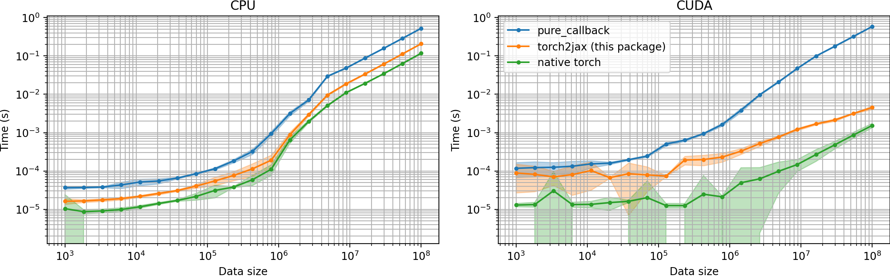

# torch2jax

This package is designed to facilitate no-copy PyTorch calling from JAX under
both eager execution and JIT. It leverages the JAX C++ extension interface,
enabling operations on both CPU and GPU platforms. Moreover, it allows for
executing arbitrary PyTorch code from JAX under eager execution and JIT.

This project was inspired by the jax2torch repository
[https://github.com/lucidrains/jax2torch](https://github.com/lucidrains/jax2torch)
and has been made possible due to an amazing tutorial on extending JAX
[https://github.com/dfm/extending-jax](https://github.com/dfm/extending-jax).
Comprehensive JAX documentation
[https://github.com/google/jax](https://github.com/google/jax) also
significantly contributed to this work.

Although I am unsure this functionality could be achieved without C++/CUDA, the
C++ compilation is efficiently done using PyTorch's portable CUDA & C++
compilation features, requiring minimal configuration.

*Tested and developed with (python==3.9.13, torch==2.0.1 jax==0.4.8)*

# Install

```bash
$ pip install git+https://github.com/rdyro/torch2jax.git
```

# Usage

With a single output

```python
import torch
import jax
from jax import numpy as jnp
from torch2jax import torch2jax # this converts a Python function to JAX

def torch_fn(a, b):
      return a + b

shape = (10, 2)
a, b = torch.randn(shape), torch.randn(shape)
jax_fn = torch2jax(torch_fn, example_args=(a, b)) # with example argumetns
jax_fn = torch2jax(torch_fn, output_shapes=[a.shape]) # make this a list of shapes always
jax_fn = torch2jax(torch_fn, output_shapes_fn=lambda a, b: [a.shape]) # make this a list of shapes always

prngkey = jax.random.PRNGKey(0)
device = jax.devices("cuda")[0] # both CPU and CUDA are supported
a = jax.device_put(jax.random.normal(prngkey, shape), device)
b = jax.device_put(jax.random.normal(prngkey, shape), device)

# call the no-copy torch function
out = jax_fn(a, b)[0] # notice we always output a list of results

# call the no-copy torch function **under JIT**
out = jax.jit(jax_fn)(a, b)[0]
```

With a multiple outputs

```python
def torch_fn(a, b):
    layer = torch.nn.Linear(2, 20).to(a)
    return a + b, torch.norm(a), layer(a * b)


shape = (10, 2)
a, b = torch.randn(shape), torch.randn(shape)
jax_fn = torch2jax(torch_fn, example_args=(a, b))  # with example argumetns

prngkey = jax.random.PRNGKey(0)
device = jax.devices("cuda")[0]
a = jax.device_put(jax.random.normal(prngkey, shape), device)
b = jax.device_put(jax.random.normal(prngkey, shape), device)

# call the no-copy torch function
x, y, z = jax_fn(a, b)

# call the no-copy torch function **under JIT**
x, y, z = jax.jit(jax_fn)(a, b)

```

# Timing Comparison vs `pure_callback`

This package achieves a much better performance when calling PyTorch code from
JAX because it does not copy its input arguments and does not move CUDA data off
the GPU.




# Current Limitations of `torch2jax`

- compilation happens on module import and can take 1-2 minutes (it will be cached afterwards)
- in the Pytorch function all arguments must be tensors, all outputs must be tensors
- all arguments must be on the same device and of the same datatype, either float32 or float64
- in JAX, the wrapped function always returns a tuple of tensors (possibly a tuple of 1)
- on the GPU, the maximum number of input arguments is 20, the output arguments
  is 20 and the maximum dimension of any tensor is 7 (so, 8-D and up tensors are
  not allowed)
- a shape must be a tuple of at least one element or a list, a shape represented
  as an integer is not yet allowed
- the current implementation does not support batching, that's on the roadmap
- the current implementation does not define the VJP rule, in current design, this has to be done in 
  Python

# Changelog

- version 0.1.1
  - bug-fix: functions do not get overwritten, manual fn id parameter replaced with automatic id generation
  - compilation caching is now better

- version 0.1.0
  - first working version of the package


# Roadmap

- [x] call PyTorch functions on JAX data without input data copy
- [x] call PyTorch functions on JAX data without input data copy under jit
- [x] support both GPU and CPU
- [ ] (feature) support partial CPU building on systems without CUDA
- [ ] (user-friendly) support functions with a single output (return a single output, not a tuple)
- [ ] (user-friendly) support arbitrary argument input and output strucutre (use pytrees on the 
      Python side)
- [ ] (user-friendly) add many, many more assertions throughout the Python code for sanity when 
      debugging
- [ ] (feature) check tensors are contiguous (the method implemented here requires contiguous JAX 
      tensors, but I do not how to check that under JIT)
- [ ] (tests) test how well device mapping works on multiple GPUs
- [ ] (tests) setup automatic tests for multiple versions of Python, PyTorch and JAX
- [ ] (feature) support batching (e.g., support for `jax.vmap`)
- [ ] (feature) support integer input/output types
- [ ] (feature) support mixed-precision arguments in inputs/outputs
- [ ] (feature) look into supporting in-place functions (support for output without copy)
- [ ] (feature) support defining VJP for the wrapped function (import the experimental functionality 
      from [jit-JAXFriendlyInterface](https://github.com/rdyro/jfi-JAXFriendlyInterface))
- [ ] (feature) support TPU

# Coverage Report

```
Name                          Stmts   Miss  Cover
-------------------------------------------------
torch2jax/__init__.py             4      0   100%
torch2jax/api.py                 47      0   100%
torch2jax/compile.py             16      0   100%
torch2jax/dlpack_passing.py      34      7    79%
torch2jax/lowering_rule.py       29      1    97%
torch2jax/utils.py               12      0   100%
-------------------------------------------------
TOTAL                           142      8    94%
```