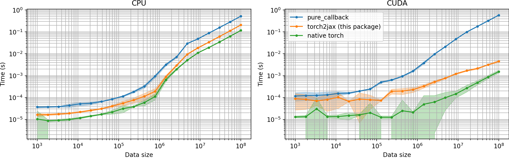

# Welcome to `torch2jax`


<br />

This package is designed to facilitate no-copy PyTorch calling from JAX under
both eager execution and JIT. It leverages the JAX C++ extension interface,
enabling operations on both CPU and GPU platforms. Moreover, it allows for
executing arbitrary PyTorch code from JAX under eager execution and JIT.

The intended application is efficiently running existing PyTorch code (like ML
models) in JAX applications with very low overhead.

This project was inspired by the jax2torch repository
[https://github.com/lucidrains/jax2torch](https://github.com/lucidrains/jax2torch)
and has been made possible due to an amazing tutorial on extending JAX
[https://github.com/dfm/extending-jax](https://github.com/dfm/extending-jax).
Comprehensive JAX documentation
[https://github.com/google/jax](https://github.com/google/jax) also
significantly contributed to this work.

Although I am unsure this functionality could be achieved without C++/CUDA, the
C++ compilation is efficiently done using PyTorch's portable CUDA & C++
compilation features, requiring minimal configuration.

*Tested and developed with (python==3.9.13, torch==2.0.1 jax==0.4.8)*

# Install

```bash
$ pip install git+https://github.com/rdyro/torch2jax.git
```

# Usage

With a single output

```python
import torch
import jax
from jax import numpy as jnp
from torch2jax import torch2jax # this converts a Python function to JAX
from torch2jax import Size # this is torch.Size, a tuple-like shape representation

def torch_fn(a, b):
      return a + b

shape = (10, 2)
a, b = torch.randn(shape), torch.randn(shape)
jax_fn = torch2jax(torch_fn, a, b)  # without output_shapes, torch_fn **will be evaluated once**
jax_fn = torch2jax(torch_fn, a, b, output_shapes=Size(a.shape))  # torch_fn will NOT be evaluated

prngkey = jax.random.PRNGKey(0)
device = jax.devices("cuda")[0] # both CPU and CUDA are supported
a = jax.device_put(jax.random.normal(prngkey, shape), device)
b = jax.device_put(jax.random.normal(prngkey, shape), device)

# call the no-copy torch function
out = jax_fn(a, b)

# call the no-copy torch function **under JIT**
out = jax.jit(jax_fn)(a, b)
```

With a multiple outputs

```python
def torch_fn(a, b):
    layer = torch.nn.Linear(2, 20).to(a)
    return a + b, torch.norm(a), layer(a * b)


shape = (10, 2)
a, b = torch.randn(shape), torch.randn(shape)
jax_fn = torch2jax(torch_fn, a, b)  # with example argumetns

prngkey = jax.random.PRNGKey(0)
device = jax.devices("cuda")[0]
a = jax.device_put(jax.random.normal(prngkey, shape), device)
b = jax.device_put(jax.random.normal(prngkey, shape), device)

# call the no-copy torch function
x, y, z = jax_fn(a, b)

# call the no-copy torch function **under JIT**
x, y, z = jax.jit(jax_fn)(a, b)

```

# Automatically defining gradients

Automatic reverse-mode gradient definitions are now supported for wrapped
pytorch functions with the method `torch2jax_with_vjp`

```python
import torch
import jax
from jax import numpy as jnp
import numpy as np

from torch2jax import torch2jax_with_vjp

def torch_fn(a, b):
  return torch.nn.MSELoss()(a, b)

shape = (6,)

xt, yt = torch.randn(shape), torch.randn(shape)

# `depth` determines how many times the function can be differentiated
jax_fn = torch2jax_with_vjp(torch_fn, xt, yt, depth=2) 


# we can now differentiate the function (derivatives are taken using PyTorch autodiff)
g_fn = jax.grad(jax_fn, argnums=(0, 1))
x, y = jnp.array(np.random.randn(*shape)), jnp.array(np.random.randn(*shape))

print(g_fn(x, y))

# JIT works too
print(jax.jit(g_fn)(x, y))

```

Caveats: 

- `jax.hessian(f)` will not work since `torch2jax` uses forward differentiation, but
  the same functionality can be achieved using `jax.jacobian(jax.jacobian(f))`
- input shapes are fixed for one wrapped function and cannot change, use
  `torch2jax_with_vjp/torch2jax` again if you need to alter the input shapes
- in line with JAX philosphy, PyTorch functions must be non-mutable,
  [torch.func](https://pytorch.org/docs/master/func.html) has a good description
  of how to convert e.g., PyTorch models, to non-mutable formulation


# Timing Comparison vs `pure_callback`

This package achieves a much better performance when calling PyTorch code from
JAX because it does not copy its input arguments and does not move CUDA data off
the GPU.




# Current Limitations of `torch2jax`

- compilation happens on module import and can take 1-2 minutes (it will be cached afterwards)
- in the Pytorch function all arguments must be tensors, all outputs must be tensors
- all arguments must be on the same device and of the same datatype, either float32 or float64
- an input/output shape (e.g. `output_shapes=` kw argument) representations (for
  flexibility in input and output structure) must be wrapped in `torch.Size` or
  `jax.ShapeDtypeStruct`
- the current implementation does not support batching, that's on the roadmap
- the current implementation does not define the VJP rule, in current design, this has to be done in 
  Python