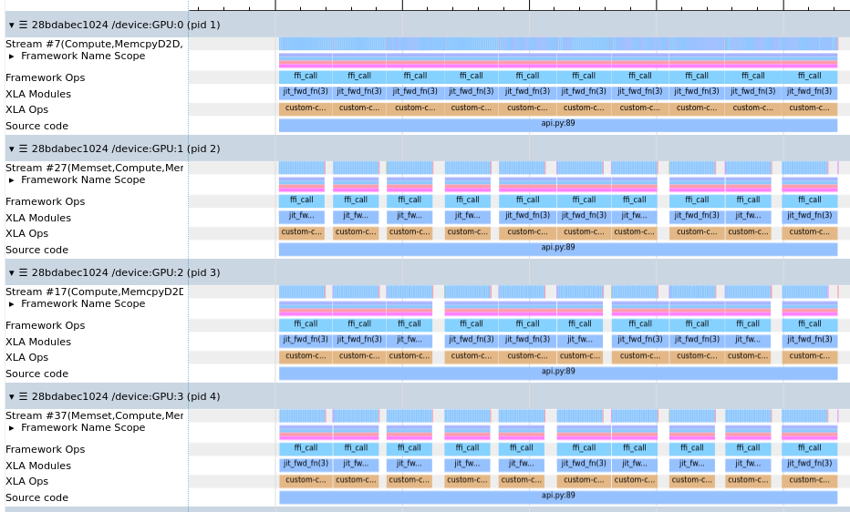

# Multi-device (multi-GPU)

`torch2jax` runs PyTorch code on sharded JAX arrays, across multiple GPUs (or
CPU devices), under `jax.jit` and with gradients. The torch function is called
once per device, **concurrently**, on that device's shard, and the GPUs compute
in parallel.

The recommended way is JAX's **explicit sharding**: shard your arrays, pass
`out_specs=` and call the wrapped function like any other JAX function.

- **the sharding lives in the types** &mdash; `torch2jax` reads the input
  shardings from the arrays themselves, you only state how the outputs are
  sharded
- **no hidden communication** &mdash; a torch function is opaque to JAX, so
  `torch2jax` never implicitly all-gathers sharded inputs, every collective in
  your program is one you asked for
- **mistakes are errors, not slowdowns** &mdash; a missing or unsupported
  `out_specs` raises an error instead of silently gathering the full arrays onto
  every device
- **it composes with JAX** &mdash; `jax.jit`, `jax.grad` and the other mesh axes
  work as usual, cotangents of replicated inputs (e.g., parameters) are
  `psum`-ed automatically
- **no device synchronization** &mdash; the torch computation is enqueued on
  XLA's CUDA stream, so JAX and torch work overlap

If you already write per-shard code, calling `torch2jax` inside `jax.shard_map`
works too, see [Inside `jax.shard_map`](#inside-jaxshard_map).

> Tip: you can try everything on this page without GPUs, by simulating 4 CPU
> devices with `XLA_FLAGS=--xla_force_host_platform_device_count=4` (set it
> before importing `jax`).

# Explicit sharding with `out_specs`

With JAX's explicit sharding, the sharding of an array is part of its type, so
every function knows how its inputs are laid out across devices without any
extra annotations. Pass `out_specs=` to `torch2jax` and call the wrapped
function directly on the sharded arrays: the torch function runs per-shard, and
the output is sharded according to `out_specs`. This is the same model JAX uses
for its own operations, so a wrapped torch function fits into an explicitly
sharded program like any other JAX function.

```python
import torch
import jax
from jax import numpy as jnp
from jax.sharding import PartitionSpec as P, NamedSharding
from torch2jax import torch2jax

model = torch.nn.Sequential(torch.nn.Linear(1024, 1024), torch.nn.SiLU(), torch.nn.Linear(1024, 16))
params = {k: jnp.asarray(v.detach().numpy()) for k, v in model.named_parameters()}
call_model = lambda x, params: torch.func.functional_call(model, params, x)

mesh = jax.make_mesh((jax.device_count(),), ("x",))  # explicit axes by default
params = jax.device_put(params, NamedSharding(mesh, P()))  # replicated
x = jax.device_put(jnp.ones((128, 1024)), NamedSharding(mesh, P("x")))  # sharded along the batch

fwd_fn = torch2jax(call_model, x, params, out_specs=P("x"), lock=True)  # functional_call mutates `model`
with jax.set_mesh(mesh):
    y = jax.jit(fwd_fn)(x, params)  # sharded along "x"
    grads = jax.jit(jax.grad(lambda params: jnp.sum(fwd_fn(x, params) ** 2)))(params)  # replicated
```

How it works:

- the call is wrapped in a `jax.shard_map` that is manual only over the mesh
  axes the inputs are sharded along, other mesh axes are left alone (e.g., on a
  `("x", "y")` mesh with inputs sharded along `"x"` only, the torch function is
  called per `"x"` shard with the full `"y"` extent)
- the `in_specs` are read from the input types, you only provide `out_specs`
- `out_specs` is a `PartitionSpec` or a prefix tree of the outputs, just like
  the `out_specs` of `jax.shard_map`: it states how the per-shard outputs form
  the global output
- `output_shapes`, if given, describe the **global** outputs and are split
  per-shard by `out_specs`, the torch function is not run to infer per-shard
  output shapes

```python
w = jax.device_put(jnp.ones((1024, 16)), NamedSharding(mesh, P()))
torch_fn = lambda x, w: (x @ w, x.sum(-1))
output_shapes = (jax.ShapeDtypeStruct((128, 16), jnp.float32), jax.ShapeDtypeStruct((128,), jnp.float32))

# one spec for both outputs (a prefix of the output tree), global output shapes
f = torch2jax(torch_fn, x, w, output_shapes=output_shapes, out_specs=P("x"))
with jax.set_mesh(mesh):
    y, s = jax.jit(f)(x, w)  # the torch function sees x[16, 1024] per shard on 8 devices
```

Since a torch function is opaque to JAX, `torch2jax` refuses to guess the
per-shard semantics:

- inputs sharded along explicit mesh axes without `out_specs` raise an error,
  replicate them explicitly (`jax.sharding.reshard(x, P())`) to call the torch
  function on the full arrays instead
- `out_specs` over **Auto** mesh axes raises an error, since XLA would silently
  all-gather the inputs; `jax.make_mesh` creates explicit axes by default in
  recent JAX, in older JAX (e.g., 0.7.x) pass them explicitly:

```python
from jax.sharding import AxisType

mesh = jax.make_mesh((jax.device_count(),), ("x",), axis_types=(AxisType.Explicit,))
```

# Inside `jax.shard_map`

Explicit sharding with `out_specs` is the recommended way, but if you already
write per-shard code, call `torch2jax` inside `jax.shard_map` as usual, the
torch function sees the local shards. Gradients type-check with the default `check_vma=True`, and
cotangents of replicated inputs (e.g., parameters) are `psum`-ed automatically.

```python
@jax.jit
@jax.shard_map(mesh=mesh, in_specs=(P("x"), P()), out_specs=P("x"))
def fwd_fn_shard_map(x, params):
    return torch2jax(call_model, x, params, lock=True)(x, params)

with jax.set_mesh(mesh):
    y = fwd_fn_shard_map(x, params)
    grads = jax.grad(lambda params: jnp.sum(fwd_fn_shard_map(x, params) ** 2))(params)
```

# Concurrency and `lock=`

On multiple devices, the torch function is called **concurrently**, once per
device, from different threads. Pure tensor code is fine, but stateful torch
code, e.g., `torch.func.functional_call` (it temporarily swaps the parameters of
a shared module), can silently produce wrong results.

- `lock=True` runs all torch calls (forward and backward) under a process-wide
  lock
- `lock=my_lock` uses your own lock (any context manager), e.g., one per model

```python
import threading

model_lock = threading.Lock()
fwd_fn = torch2jax(call_model, x, params, out_specs=P("x"), lock=model_lock)
```

The GPUs still compute in parallel under a lock, since torch only enqueues work.
The exception is a torch function that synchronizes with the host (`.item()`,
`.cpu()`, data-dependent shapes like `x[mask]`), in which case the devices run
one after another.

<p align="center">
  
  <p align="center">Fig: Overlapping torch calls on multiple devices (RTX A4000 x 4)</p>
</p>

# CUDA streams

The torch function runs on XLA's CUDA stream, so the torch computation is
ordered with the surrounding JAX computation without synchronizing the device.
It is also ordered with torch's own (current) stream using CUDA events:

- torch work queued before the call (e.g., a weight update) is visible to the
  torch function
- torch work queued after the call sees the state the torch function modified
  (e.g., a buffer updated in-place)

> Note: tensors created inside the torch function belong to XLA's stream in
> torch's caching allocator. If you keep such a tensor (e.g., as a cache) and
> later use it from regular torch code, call
> `tensor.record_stream(torch.cuda.current_stream())` there, or write into a
> preallocated tensor instead (`buf.copy_(...)`).

# Migrating from `output_sharding_spec`

- `output_sharding_spec=` is a deprecated alias of `out_specs=`, which now also
  works with gradients (`torch2jax` with `depth > 0`)
- `custom_partitioning` and the global switch to the GSPMD partitioner
  (`jax_use_shardy_partitioner=False`) were removed
- inputs sharded along explicit mesh axes are no longer all-gathered
  implicitly, see [Explicit sharding with `out_specs`](#explicit-sharding-with-out_specs)

> Note: `jax.vmap`'s semantics might indicate that it can compute on sharded
arrays, it can work, but it is not recommend, and because of `torch2jax`'s
implementation will likely be executed sequentially (and likely be slow).
